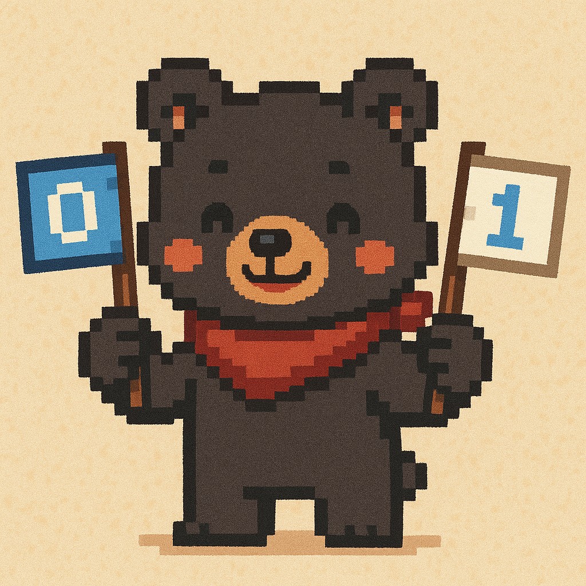

# BitFlagsJs
A lightweight library for easy bit flag management in JavaScript and TypeScript. BitFlagsJs is a simple implementation of a BitArray, providing an efficient way to handle bit flags with a minimal API.

[](https://www.npmjs.com/package/bitflagsjs)
[](https://opensource.org/licenses/MIT)

## Installation

```bash
npm install bitflagsjs
# or
yarn add bitflagsjs
```

## Key Features

BitFlagsJs simplifies bit flag operations in JavaScript and TypeScript:
- Simple BitArray implementation with minimal overhead
- Manage bit flags using arrays of 32-bit integers
- Simple API for setting, unsetting, and checking bits
- Automatic handling of indices beyond 32-bit boundaries
- First-class TypeScript support with complete type definitions

## Usage

### Importing

```javascript
// ES Modules
import BitFlags from 'bitflagsjs';

// CommonJS
// const BitFlags = require('bitflagsjs').default;
```

### TypeScript Usage

```typescript
import BitFlags from 'bitflagsjs';

// Type-safe bit flags
const flags = new BitFlags();
flags.set(10);
const isSet: boolean = flags.is(10);
const flagArray: number[] = flags.get();
```

### Creating an Instance

```javascript
// Initialize with default value [0]
const bitFlags = new BitFlags();

// Initialize with custom values
const initializedFlags = new BitFlags([5, 10]); // [0x00000101, 0x00000a00]
```

### Methods

#### get()

Returns the current bit mask array.

```javascript
const bitFlags = new BitFlags();
bitFlags.set(2);
bitFlags.set(35);
console.log(bitFlags.get()); // [4, 8]  // [0x00000100, 0x00000008]
```

#### is(index)

Checks if the bit at the specified index is set.

```javascript
const bitFlags = new BitFlags([3]); // [0x00000011]
const isMaskedFirstBit = bitFlags.is(0);  // true
const isMaskedSecondBit = bitFlags.is(1); // true
const isMaskedThirdBit = bitFlags.is(2);  // false
```

#### set(index)

Sets the bit at the specified index.

```javascript
const bitFlags = new BitFlags(); // [0x00000000]
bitFlags.set(0); // [0x00000001]
bitFlags.set(1); // [0x00000011]
bitFlags.set(4); // [0x00001011]
```

#### unset(index)

Unsets the bit at the specified index.

```javascript
const bitFlags = new BitFlags([3]); // [0x00000011]
bitFlags.unset(0); // [0x00000010]
bitFlags.unset(1); // [0x00000000]
```

#### clear()

Clears all bit flags, resetting the array to its initial state.

```javascript
const bitFlags = new BitFlags([15, 7]); // [0x0000000f, 0x00000007]
bitFlags.clear(); // [0x00000000]
console.log(bitFlags.get()); // [0]
```

#### count()

Returns the number of bits set in the bit flag array.

```javascript
const bitFlags = new BitFlags([3]); // [0x00000011] (2 bits set)
console.log(bitFlags.count()); // 2

bitFlags.set(4); // [0x00010011] (3 bits set)
console.log(bitFlags.count()); // 3
```

#### Bitwise Operations

BitFlagsJs supports bitwise operations between two BitFlags instances:

##### and(other)

Returns a new BitFlags instance with the bit flags that are set in both this and the other BitFlags instance.

```javascript
const flags1 = new BitFlags([5]); // [0x00000101]
const flags2 = new BitFlags([3]); // [0x00000011]
const result = flags1.and(flags2); // [0x00000001]
console.log(result.get()); // [1]
```

##### or(other)

Returns a new BitFlags instance with the bit flags that are set in either this or the other BitFlags instance.

```javascript
const flags1 = new BitFlags([5]); // [0x00000101]
const flags2 = new BitFlags([3]); // [0x00000011]
const result = flags1.or(flags2); // [0x00000111]
console.log(result.get()); // [7]
```

##### xor(other)

Returns a new BitFlags instance with the bit flags that are set in either this or the other BitFlags instance, but not in both.

```javascript
const flags1 = new BitFlags([5]); // [0x00000101]
const flags2 = new BitFlags([3]); // [0x00000011]
const result = flags1.xor(flags2); // [0x00000110]
console.log(result.get()); // [6]
```

##### not()

Returns a new BitFlags instance with all bits flipped.

```javascript
const flags = new BitFlags([5]); // [0x00000101]
const result = flags.not(); // [0xfffffffa]
console.log(result.is(0)); // false
console.log(result.is(1)); // true
console.log(result.is(2)); // true
```

## Example: User Permissions

```javascript
// Define permissions
const PERMISSIONS = {
  READ: 0,
  WRITE: 1,
  DELETE: 2,
  ADMIN: 3
};

// Set user permissions
const userPermissions = new BitFlags();
userPermissions.set(PERMISSIONS.READ);
userPermissions.set(PERMISSIONS.WRITE);

// Check permissions
if (userPermissions.is(PERMISSIONS.READ)) {
  console.log('User has read permission');
}

if (!userPermissions.is(PERMISSIONS.ADMIN)) {
  console.log('User does not have admin permission');
}

// Remove permissions
userPermissions.unset(PERMISSIONS.WRITE);
```

## Technical Details

BitFlagsJs manages bit flags using arrays of 32-bit integers. When using indices beyond 32, new array elements are automatically allocated.

## Contributing

Want to contribute to this project? You're welcome!

1. Fork this repository
2. Create a feature branch (`git checkout -b feature/amazing-feature`)
3. Commit your changes (`git commit -m 'feat: add amazing feature'`)
4. Push to the branch (`git push origin feature/amazing-feature`)
5. Open a Pull Request

### Commit Message Convention

- `feat`: Add a new feature
- `fix`: Fix a bug
- `docs`: Update documentation
- `style`: Format code, missing semicolons, etc. (no code change)
- `refactor`: Refactor code
- `test`: Add or update tests
- `chore`: Update build process or auxiliary tools

## License

This project is licensed under the MIT License - see the [LICENSE](LICENSE) file for details.

## Contact

- Issues: [GitHub Issues](https://github.com/zerodice0/bitFlagsJs/issues)
- Author: [zerodice0](https://github.com/zerodice0)

*Note: A Korean version of this document is available at [README-KR.md](README-KR.md)*